# lab04

## 输入的Prompt:
我想开发一个自动驾驶系统，车辆可以自主驾驶、检测障碍物、识别交通信号灯、保持车道行驶，并在必要时自动刹车。请帮我提取该系统的核心用例，输出格式为 JSON。每个用例包含：用例名称、描述、参与者。


## 输出格式定义:

输出为 JSON，每个用例包含字段：name、description、actors
```json
{
  "use_cases": [
    {
      "name": "用例名称",
      "description": "用例描述",
      "actors": ["参与者列表"]
    }
  ]
}
```

## 生成的需求模型说明

## 具体实现

### Task 1

chmod +x curl_api.sh
./curl_api.sh

#### 截图

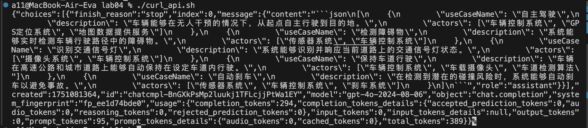


### Task 2

#### 截图
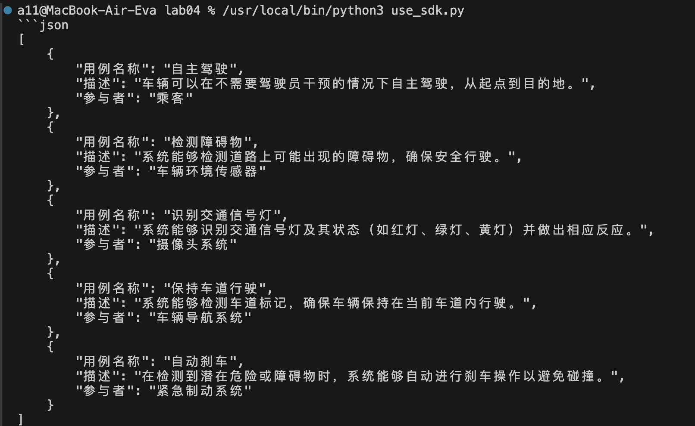

### Task 3
详见task3.py

#### 选型
串行、并行和迭代框架中选择。

并行一般适用于领域跨度大、信息分类明显的复杂系统，自动驾驶系统的领域跨度并不大
需求模型生成任务结构明确 + 有规范格式（DSL） + 一步产出即可用，一轮完成提取 + 结构化就已经很有效，不需要再绕回来修改，所以也不太用得到迭代框架
串行框架结构清晰、实现简单

#### 构建 DSL 结构定义

{
  "system": "系统名称",
  "modules": ["模块A", "模块B", ...],
  "usecases": [
    {
      "name": "用例英文名",
      "description": "用例中文描述",
      "actors": ["角色"],
      "module": "所属模块",
      "includes": [],
      "extends": [],
      "triggers": ["触发条件"],
      "results": ["执行结果"]
    }
  ]
}

#### MultiAgent Workflow简要说明
用户输入自然语言需求描述
      ↓
Agent 1：Requirement Extractor
【输出】用例名称、功能描述、参与者
      ↓
Agent 2：Model Formatter
【输出】结构化 JSON 格式的 DSL
      ↓
Agent 3：DSL Verifier
【输出】检查并反馈 DSL 结构是否合规或需补充

##### Agent1 & System Prompt
角色：需求提取 Agent
输入：用户的自然语言需求描述
输出：一个结构化的用例清单，包括：用例名称、功能描述、参与者

Prompt
你是一个专业的软件需求分析专家，擅长从自然语言中识别系统的功能需求。

现在请根据以下用户提供的系统描述，提取出所有核心“用例”。

每个用例请包括以下字段：
- 用例名称（name）：简洁、准确地概括功能
- 功能描述（description）：描述该用例的主要行为
- 参与者（actors）：参与该用例的主体（如：用户、系统、管理员等）

请用结构化列表输出，并使用简洁、准确的中文术语。请勿生成 JSON，仅用清晰的文本结构列出即可。

##### Agent2 & System Prompt
你是一个系统建模工程师，擅长将软件用例转换为符合 DSL 语法的 JSON 模型。

现在请根据下面给出的用例清单，将其转换为如下结构的 JSON（DSL）格式。

每个用例字段应包括：
- name（字符串）：用例名称，使用小驼峰英文
- includes（数组）：包含的子用例（如无请留空数组）
- extends（数组）：扩展的父用例（如无请留空数组）

最终结构如下所示：
```json
{
  "name": "系统名称",
  "usecases": [
    {
      "name": "useCaseName",
      "includes": [],
      "extends": []
    }
  ]
}
```
请注意字段拼写和 JSON 格式正确性。

##### Agent3 & System Prompt
角色：DSL 校验与补全 Agent
输入：DSL 输出结果
输出：修复结构错误或提示缺失字段

Agent 3 Prompt：DSL Verifier

你是一名建模语言的格式审查专家，擅长检查 DSL 模型格式是否合规。

现在请检查以下 JSON 模型是否符合如下要求：

- 是否是合法 JSON（结构完整）
- 是否包含必要字段（name、usecases[]）
- 每个 usecase 是否包含 name、includes、extends 三个字段
- 所有字段拼写是否正确
- 所有数组字段是否为数组（即使为空）

如有问题，请指出并给出修正后的完整 DSL；
如没有问题，请回复“DSL 合规”。

以下是 DSL 模型：
```json
{
  "name": "AutoDrivingSystem",
  "usecases": [
    {
      "name": "autonomousDriving",
      "includes": [],
      "extends": []
    },
    {
      "name": "trafficLightRecognition",
      "includes": [],
      "extends": []
    }
  ]
}
```

##### 系统用例图
从dsl中提取出所有
参与者定义
“系统”节点定义
加入“系统 ➝ 用例”、“参与者 ➝ 用例”的连接线

#### 系统用例图 外部工具
任何mermaid在线编译工具

#### 系统顺序图
agent4
根据具体的usecase生成系统顺序图
prompt
你是一个系统分析专家，请根据以下 usecase 信息，生成该用例的系统顺序图（System Sequence Diagram）
请只输出标准 Mermaid 顺序图代码，不需要多余解释
usecase 信息如下：...
任何mermaid在线编译工具

#### 概念类图
agent5
你是一位软件建模专家，请根据以下 DSL 模型，生成一个系统的概念类图
请输出标准 Mermaid 类图代码（classDiagram），包含代表系统中关键概念的类、它们的属性，以及关系（如：依赖、关联、聚合等）。
不需要多余解释，只返回 Mermaid 代码。
以下为 DSL 模型：...


#### OCL 约束
agent6你是一位 OCL（Object Constraint Language）建模专家，擅长根据系统类模型自动生成精确的 OCL 约束语句。
请根据以下 DSL 模型，为每个类生成合理的 OCL 表达式，包含：
1. 不变式（inv）：类属性约束、状态约束、数据范围约束
2. 前置条件（pre）：操作调用的前提条件
3. 后置条件（post）：操作后的状态变化（如 balance@pre
要求：
使用标准 OCL 语法
每条表达式前添加简要注释（以 -- 开头）
不要输出解释说明，只返回 OCL 代码块
以下为 DSL 模型：...


#### 截图
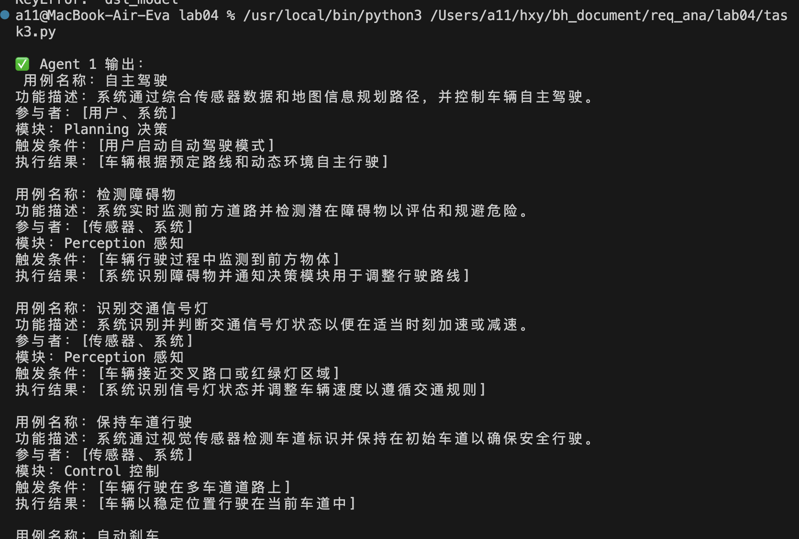
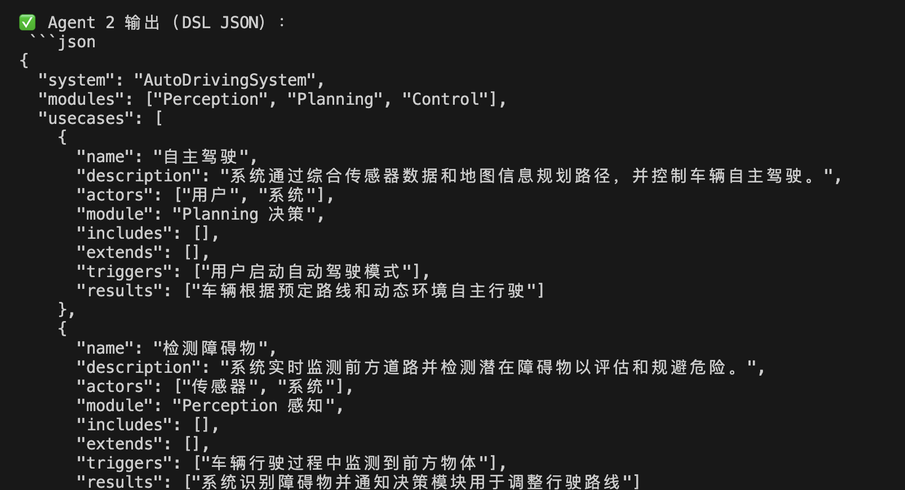
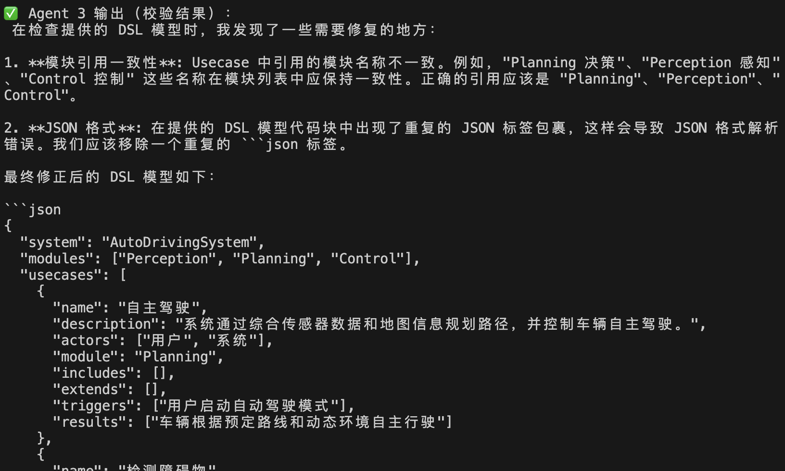
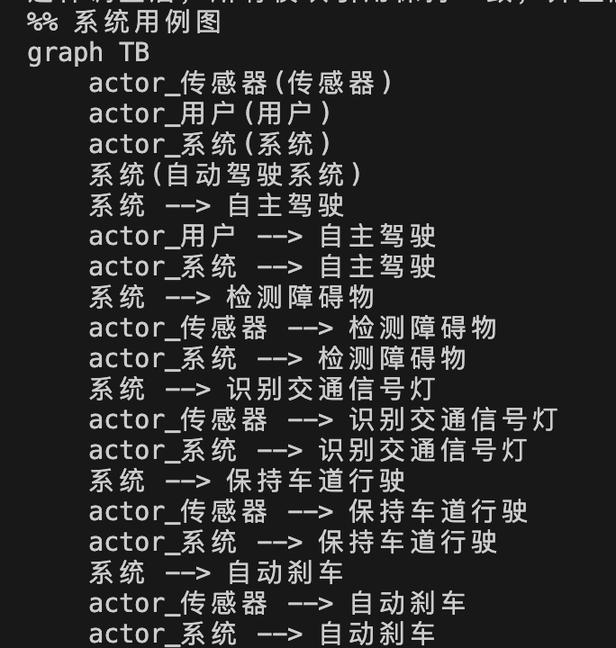
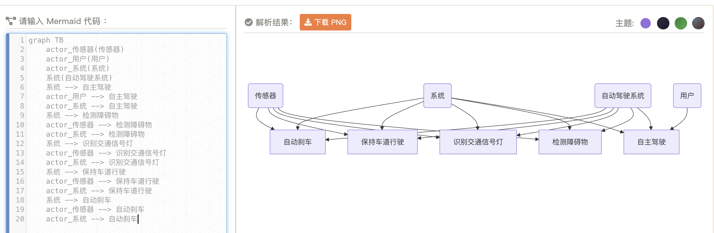
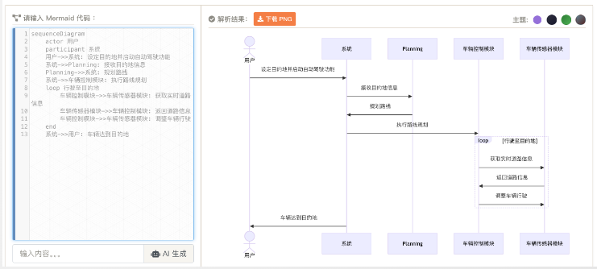
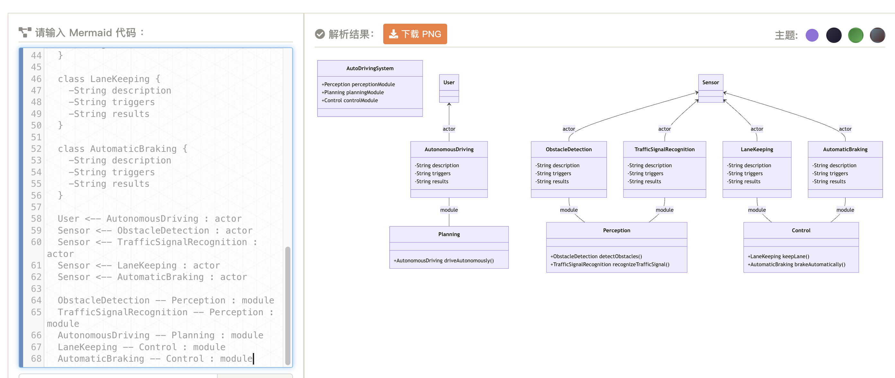
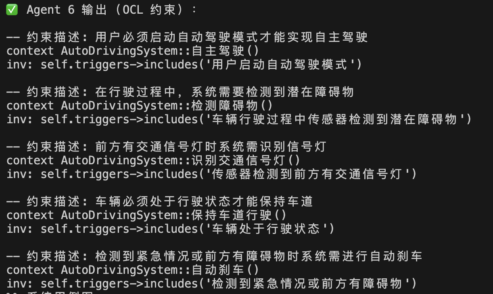
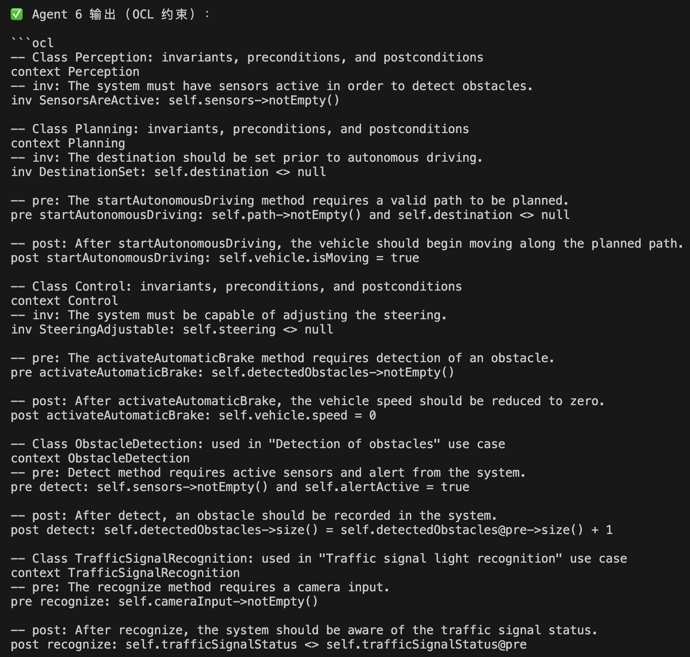


